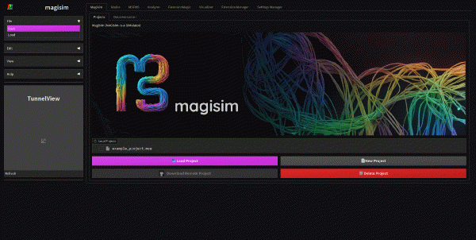

<h1>magisim</h1>

## Description

Magisim is a versatile simulation hub that brings together individual computational algorithms through an interactive graphical user interface. It is designed to be hosted on a server, allowing multiple users to access it simultaneously. This makes Magisim an affordable and powerful tool for educational environments.

The primary goal of this project is to democratize access to high-cost simulation tools, particularly for electromagnetic and other physical simulations. Magisim is designed for hobbyists, amateurs, and individuals who want to learn about these physical phenomena by visualizing and analyzing different aspects of simulations.

## Documentation

For documentation and guides, please visit the [Magisim Documentation](https://magisim.mintlify.app/introduction) on Mintlify.

## Screenshots

## Features

- Connect and collect computational algorithms.
- Hosted on a server for multi-user access.
- Affordable tool for educational environments.
- Easy-to-use node interface for algorithm composition.
- Visualize simulations, post-process data, and perform analysis.
- Built-in electromagnetic simulation engine for FDTD simulations.
- SOON: export simulation data to VTK format for visualization in ParaView.
- SOON: openEMS node for FDTD simulations.

## Contributing

We welcome contributions to make Magisim even better. If you'd like to contribute, please review our [Contribution Guidelines](CONTRIBUTING.md).

## Acknowledgments

We would like to express our gratitude to the open-source community for their valuable contributions and inspiration. We would also like to thank our teachers and mentors for their guidance and support during the development of this project.

## Contact

If you have any questions or need support, feel free to reach out to us via email at [magisim@protonmail.ch](mailto:magisim@protonmail.ch).

---
> **Note**\
> Magisim is still in development and may not be ready for production use. We are actively working on improving the software and adding new features. If you encounter any issues or have suggestions, please let us know by opening an issue on GitHub.

